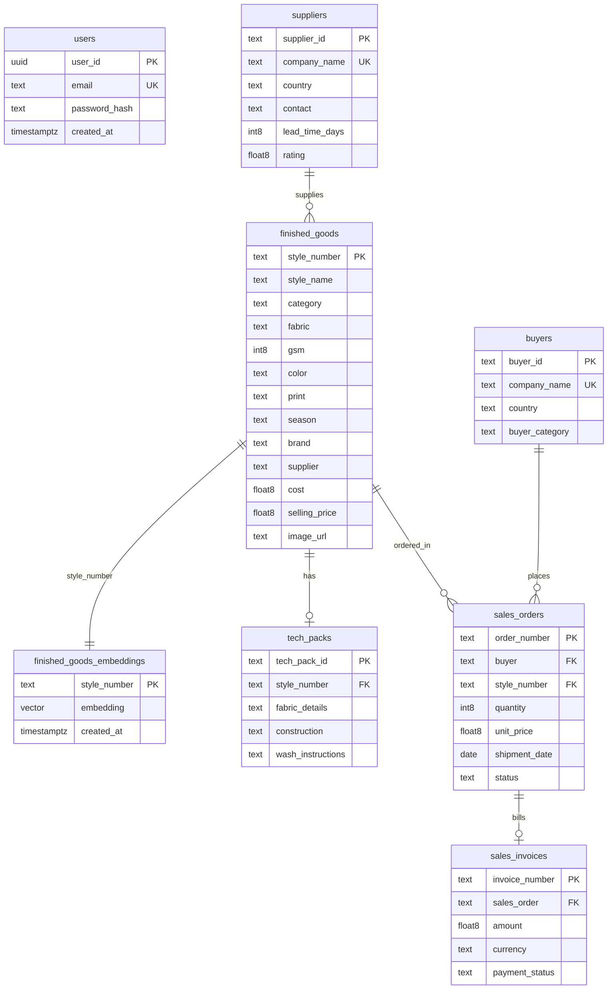

# WFX AI-Native ERP exploration layer

An AI-native exploration platform for apparel sourcing data. This repository contains the frontend and backend layer that integrates natural language database queries (NL2SQL), multi-modal product search (text/image vector search), and dynamic analytics on top of standard apparel ERP tables.

---

## 🏛️ System Architecture

The platform is designed as a decoupled client-server system:
* **Frontend:** React SPA built with Vite, TypeScript, and Tailwind CSS. Analytical dashboards are rendered via Recharts, and the chat console uses standard EventSource streams.
* **Backend:** Node.js Express server written in JavaScript (ES Modules). It handles JWT authentication, serves REST endpoints, processes multipart image files, and coordinates AI pipelines.
* **Database & AI Engine:** Supabase PostgreSQL database storing relational tables and vector embeddings. It executes similarity matching via the `pgvector` extension and translates NL prompts using OpenRouter (Llama 3.1).

---

## 🗃️ Database Schema

The database schema is structured to support relational business logic and vector similarity matching.

### Entity-Relationship Diagram



### Table Definitions

#### 1. finished_goods
Stores details for finished apparel items.
* **style_number** (`text`, PK): Unique style identifier.
* **style_name** (`text`): Descriptive name of the garment style.
* **category** (`text`): Product category (e.g., Shirts, Jackets).
* **fabric** (`text`): Material composition.
* **gsm** (`int8`): Material weight in grams per square meter.
* **color** (`text`): Base color.
* **print** (`text`): Fabric pattern (e.g., Solid, Striped).
* **season** (`text`): Sourcing seasonal collection.
* **brand** (`text`): Client apparel brand.
* **supplier** (`text`): References `suppliers.company_name`.
* **cost** (`float8`): Unit cost of production.
* **selling_price** (`float8`): Unit wholesale selling price.
* **image_url** (`text`): S3/Cloud Storage link to style reference image.

#### 2. finished_goods_embeddings
Stores high-dimensional vector representations for semantic matching.
* **style_number** (`text`, PK): References `finished_goods.style_number`.
* **embedding** (`vector(512)`): Normalized CLIP model text/image feature vector.
* **created_at** (`timestamptz`): Record timestamp.

#### 3. suppliers
Stores metadata for sourcing vendor mills.
* **supplier_id** (`text`, PK): Unique vendor key.
* **company_name** (`text`, Unique): Business name.
* **country** (`text`): Operations country.
* **contact** (`text`): Corporate email/phone string.
* **lead_time_days** (`int8`): Mean production cycle in days.
* **rating** (`float8`): Operational performance score (0.0 - 5.0).

#### 4. buyers
Stores customer data.
* **buyer_id** (`text`, PK): Unique buyer key.
* **company_name** (`text`, Unique): Buying brand name.
* **country** (`text`): Headquarter country.
* **buyer_category** (`text`): Channel category (e.g., Retailer, Wholesaler).

#### 5. sales_orders
Tracks wholesale purchasing orders.
* **order_number** (`text`, PK): Unique purchase order code.
* **buyer** (`text`): References `buyers.company_name`.
* **style_number** (`text`): References `finished_goods.style_number`.
* **quantity** (`int8`): Units ordered.
* **unit_price** (`float8`): Invoiced unit rate.
* **shipment_date** (`date`): Scheduled cargo release date.
* **status** (`text`): Logistical state (e.g., Pending, Shipped, Delivered).

#### 6. sales_invoices
Tracks payments and invoices.
* **invoice_number** (`text`, PK): Unique invoice identifier.
* **sales_order** (`text`): References `sales_orders.order_number`.
* **amount** (`float8`): Invoice monetary value.
* **currency** (`text`): Billing currency code (e.g., INR, USD).
* **payment_status** (`text`): Settlement state (e.g., Paid, Pending).

#### 7. tech_packs
Stores technical instructions for style manufacturing.
* **tech_pack_id** (`text`, PK): Unique specification file sheet key.
* **style_number** (`text`): References `finished_goods.style_number`.
* **fabric_details** (`text`): Fabric yarn counts and specs.
* **construction** (`text`): Panel assembly details.
* **wash_instructions** (`text`): Laundering instructions.

#### 8. users
System operators credentials table.
* **user_id** (`uuid`, PK): Generated record ID.
* **email** (`text`, Unique): Account email address.
* **password_hash** (`text`): Blowfish-hashed password.
* **created_at** (`timestamptz`): Registration timestamp.

---

## 🚀 Setup & Installation

### Prerequisites
- **Node.js** (v20.x or higher)
- **npm** (v10.x or higher)
- A **Supabase** database instance with the `pgvector` extension enabled.

### 1. Database Initialization
1. Connect to your Supabase project's SQL console.
2. Execute the DDL statements in the root-level [schema.sql](./schema.sql) file to create the tables, constraints, indexes, and required RPC functions.

### 2. Backend Installation & Run
1. Navigate to the backend directory:
   ```bash
   cd backend
   ```
2. Install npm packages:
   ```bash
   npm install
   ```
3. Copy the example configuration to `.env`:
   ```bash
   cp .env.example .env
   ```
4. Update `.env` with your API parameters:
   * `SUPABASE_URL` / `SUPABASE_KEY`: Supabase API credentials.
   * `JWT_SECRET`: Random hash key used to sign session cookies.
   * `OPENROUTER_API_KEY`: OpenRouter token for Llama 3.1 access.
   * `HUGGINGFACE_TOKEN`: HuggingFace User Token (with read/inference permissions) to calculate CLIP vector coordinates.
5. Start the development server (using nodemon):
   ```bash
   npm run dev
   ```
   The backend server runs natively as JavaScript ES Modules at `http://localhost:5000`.

### 3. Frontend Installation & Run
1. Open a new terminal and navigate to the frontend directory:
   ```bash
   cd ../frontend
   ```
2. Install npm packages:
   ```bash
   npm install
   ```
3. Copy the example configuration to `.env`:
   ```bash
   cp .env.example .env
   ```
4. Verify the API target points to your local backend server:
   ```env
   VITE_API_URL=http://localhost:5000
   ```
5. Launch the Vite development server:
   ```bash
   npm run dev
   ```
   The frontend application is accessible at `http://localhost:5173`.

---

## 🧪 Verification

To verify that the application compiles and bundles cleanly:

* **Backend Verification:**
  Start the server cleanly without errors:
  ```bash
  cd backend && npm run dev
  ```
* **Frontend Build Check:**
  Verify the frontend bundles cleanly without TypeScript errors:
  ```bash
  cd frontend && npm run build
  ```
